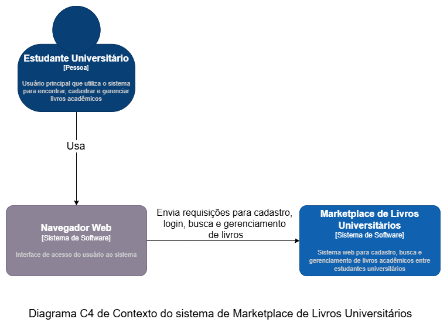
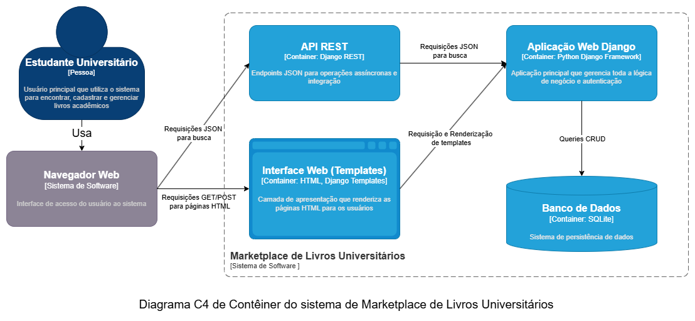
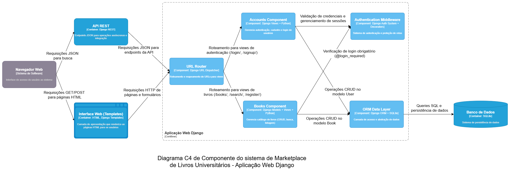

# BookExchangePlatform

## About the Project

BookExchangePlatform is a web platform developed with Django that connects university students for donating used books. The system allows users to register books with detailed information (title, author, course, ISBN), search the catalog using different strategies, manage personal bookshelves, and coordinate book exchanges and donations between users.

## How to Run

### Prerequisites
- Python 3.8 or higher
- pip (Python package manager)

### Installation and Setup

1. Clone the repository:
```bash
git clone https://github.com/Matheus-F-Scatolin/BookExchangePlatform.git
cd BookExchangePlatform/marketplace
```

2. Create and activate a virtual environment (recommended):
```bash
python -m venv venv
source venv/bin/activate  # On Windows: venv\Scripts\activate
```

3. Install dependencies:
```bash
pip install -r requirements.txt
# Or if using pyproject.toml:
pip install -e .
```

4. Run database migrations:
```bash
python manage.py migrate
```

5. Start the development server:
```bash
python manage.py runserver
```

6. Access the application at `http://localhost:8000`

## System Architecture

The project follows Django's **Model-View-Template (MVT)** pattern. This pattern is a variation of MVC (Model-View-Controller) and naturally implements separation of concerns in layers. The responsibilities in the system are:

- **Model (Data / Data Access):** Django models and the SQLite database that persist and validate data.  
- **View (Business Logic):** views that process requests, apply business rules and orchestrate operations.  
- **Template (Presentation):** templates, URLs and assets that handle rendering and user interface.  

---
Additionally, the project is organized according to the **Separation of Concerns** principle, so that each component has a specific responsibility:
- Models for data definition and business rules
- Views for control logic and request processing  
- Templates for presentation
- URLs for request routing

This combination of architectural styles provides:
- **Scalability**: Possibility of modular expansion
- **Testability**: Isolated components facilitate unit testing
- **Reusability**: Modules can be reused in other contexts

### C4 Architecture Diagrams

The system architecture is represented through C4 diagrams at three levels of abstraction:

#### Level 1 - Context Diagram
The context diagram shows the system overview and its main users:



#### Level 2 - Container Diagram
The container diagram details the main technological components of the system:



#### Level 3 - Component Diagram
The component diagram decomposes the Django Web Application into its internal modules:



### Description of Main Components

#### **Accounts Component**
Module dedicated to user management, including landing page, registration, authentication and session control. Implements both web interfaces and REST APIs for user operations.

#### **Books Component**
Responsible for the entire lifecycle of books in the marketplace: registration, listing, advanced search (by title, author and course) and catalog management. Includes administrative interface for content management.

#### **Authentication Middleware**
Security system that protects sensitive routes, manages user sessions and implements permission validations through decorators like `@login_required` and CSRF protection.

#### **URL Router**
Routing component that directs HTTP requests to appropriate modules, organizing both web endpoints and REST APIs in a centralized and hierarchical manner.

#### **ORM Data Layer**
Data abstraction layer that uses Django ORM to interact with the SQLite database, managing User and Book models, schema migrations and complex query operations.

### Books Component - _Strategy_ Design Pattern
Users may have different expectations when searching for books: they may be interested in a single book whose title is known, or in any book related to a certain subject, or even only in books related to a subject written by a specific author. To meet these diverse needs, the Books component adopts different search strategies depending on the search context. The user can choose a search type through the application interface, and the Books component identifies the corresponding context from the HTTP request. So far, five strategies have been created, each implementing its own search logic:
- *Title*: returns books whose title matches the string provided by the user;
- *Author*: returns books whose author matches the string provided by the user;
- *Course*: returns books whose course or subject matches the string provided by the user;
- *Combined*: returns books for which any field (title, author or course) matches the string provided by the user;
- *Advanced*: returns books whose title, author and course each match a different string. In this case, it is possible to ignore one or more fields by providing an empty string (which matches any value).

This approach decouples the implementation of each strategy from the context, which simplifies the creation of new strategies.
