# Benchmarking

## [Skoob](https://www.skoob.com.br)

O Skoob é uma rede social brasileira de leitores que funciona como uma estante virtual, permitindo catalogar livros, registrar leituras, trocar exemplares e interagir com a comunidade.

Nesse site, analisaremos as seguintes funcionalidades: **cadastro de novo usuário**, **página de perfil** e **ferramenta de busca em tempo real**.

---

### Documentação de Features e Funcionalidades  

#### Cadastro de novo usuário  
A tela de registro permite a criação rápida de conta com e-mail e senha, exigindo requisitos mínimos de segurança (como comprimento mínimo e validação de formato de e-mail). O fluxo é direto, sem etapas adicionais complexas, o que facilita o onboarding de novos usuários.  

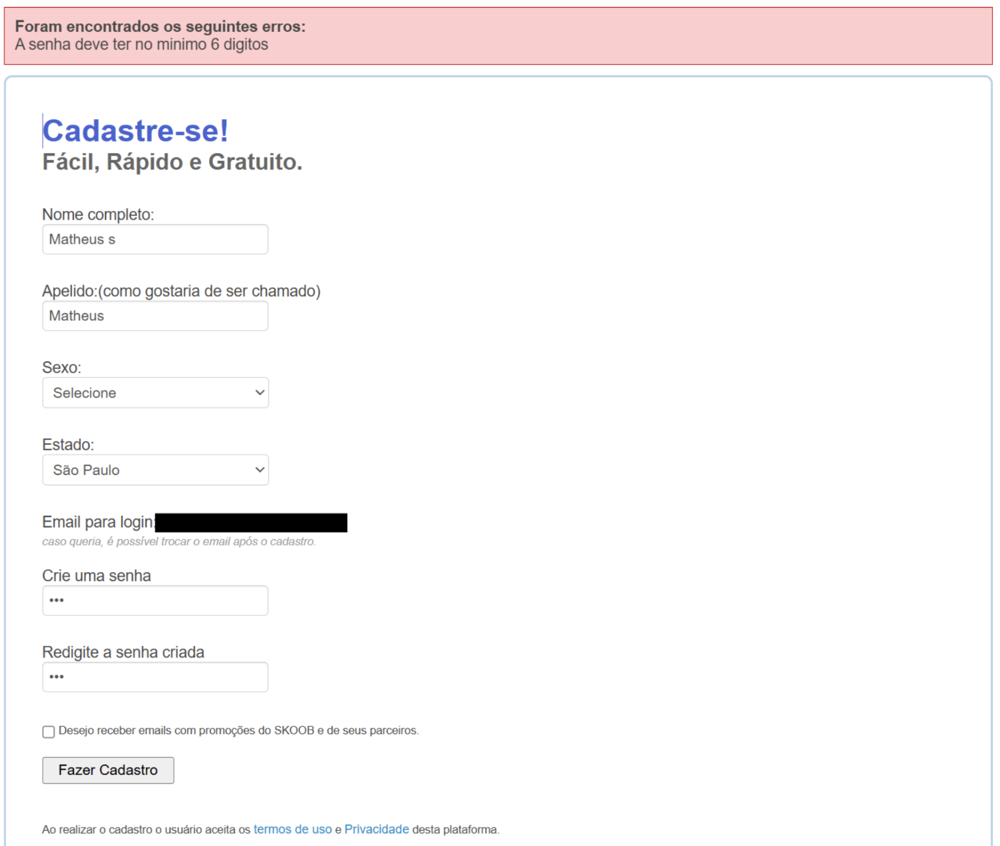

---

#### Página de perfil do usuário  
Na página de perfil, o usuário pode visualizar e organizar suas leituras em categorias como **lidos**, **lendo**, **quero ler**, **favoritos** e até estatísticas como **livros trocados** e **páginas lidas**. Esse recurso cria uma sensação de rede social, incentivando o engajamento pela gamificação (progresso, metas de leitura).  

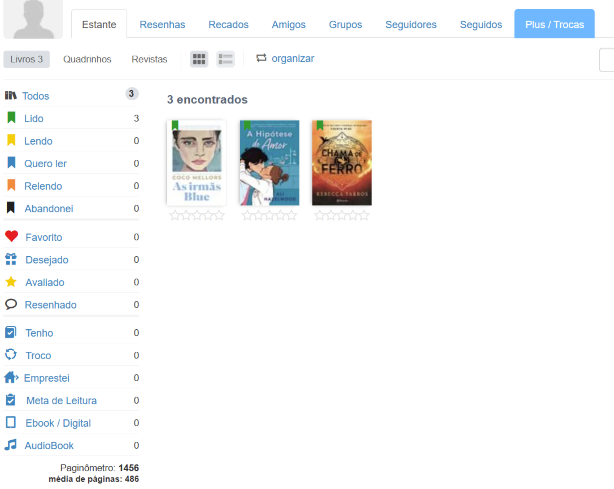

---

#### Ferramenta de busca em tempo real  
A barra de busca exibe resultados dinâmicos conforme o usuário digita, sem necessidade de pressionar *enter*. A pré-visualização mostra título, autor e capa do livro, ajudando a evitar confusões e acelerando o acesso à obra desejada.  

---

### Pontos positivos e negativos  

#### Pontos Positivos:  
- Processo de cadastro rápido e intuitivo.  
- Perfil do usuário funciona como uma estante virtual, incentivando engajamento.  
- Busca dinâmica e responsiva, com pré-visualização de resultados.  

#### Pontos Negativos:  
- Interface um pouco poluída, com excesso de informações em uma mesma tela.  
- Design sem a fluidez de apps mais modernos.  
- Demora para carregar os resultados da busca e para efetuar o registro de novo usuário.

---

### Requisitos  

A partir das informações acima, temos alguns requisitos que podemos extrair da análise:  
- Criar **fluxo de cadastro simples**, mas com validações de segurança.  
- Implementar **busca em tempo real com pré-visualização**, garantindo fluidez e desempenho.  
- Adotar **design mais limpo e moderno**, evitando sobrecarga de informações.  
- Oferecer **filtros avançados** para busca de livros.  

-------------------------------------------------------------------------------------------------------------------------------

## [Amazon](https://www.amazon.com.br)

A Amazon é um marketplace geral com alto volume de catálogo, mecanismos de recomendação e páginas de produto (PDP) muito completas.

Nesse site, analisaremos as seguintes funcionalidades: **catálogo / recomendações**, **barra de busca**, **resultado de busca**, **descrição do produto (PDP)**, **recomendações relacionadas**, **detalhes técnicos do produto**, **avaliações do produto** e **sistema de login**.

---

### Documentação de Features e Funcionalidades  

#### Catálogo — destaque e recomendações na homepage  
A homepage apresenta blocos com produtos recomendados (com base no histórico) e seções temáticas. Esses blocos são visualmente proeminentes e servem tanto para descoberta quanto para reengajamento.

O que observar / capturar: homepage com blocos “Compre novamente”, “Continue de onde parou”, banners promocionais.
Uso observado: recomenda produtos com base em histórico e comportamento.
UX notes: bom para incentivar a descoberta; pode poluir se houver muitas seções.

---

#### Barra de busca (auto-complete / sugestões)  
A barra de busca mostra sugestões enquanto digita e resultados rápidos (pré-visualização com capa/título).

O que observar / capturar: campo de busca aberto com sugestão/preview.
Uso observado: acelera o encontro do livro pelo título/autor/termo.
UX notes: útil para evitar erros de digitação; permite acesso direto ao PDP sem precisar carregar a página de resultados. 

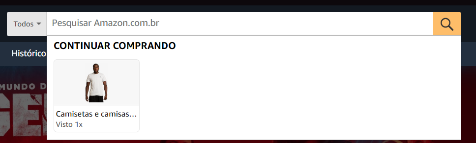

---

#### Resultado de busca  
Página com lista de resultados e painel lateral de filtros (departamentos, entrega, Prime etc.). Exibe preço, avaliação e selo (ex.: Prime, mais vendido).

O que observar / capturar: lista de resultados com filtros à esquerda; ordenação e contagem de resultados.
Uso observado: usuários refinam por condição (novo/usado), preço, tempo de entrega.
UX notes: filtros poderosos — importante replicar filtros relevantes (curso, edição, condição para marketplace universitário).
  
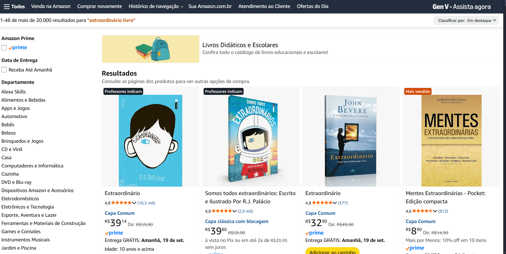

—

#### Página de detalhe do produto (PDP) — descrição e ações  
PDP concentra imagem/capas, título, autores, sinopse, formatos disponíveis (Kindle, físico), preço e botões de ação (Adicionar ao carrinho / Comprar agora). Mostra ofertas alternativas (outros vendedores/usado).

O que observar / capturar: PDP completa (imagem, sinopse, bloco de compra, “outros usados/novos”).
Uso observado: consolida informação sobre edições/formato e múltiplas ofertas.
UX notes: muito completa — ótima inspiração, porém excessiva para um fluxo de troca simples (pode confundir).

  

—

#### Recomendações relacionadas (frequentemente comprados juntos / vistos juntos)  
Exposição de produtos relacionados e bundles (frequentemente comprados juntos).

O que observar / capturar: seção “Frequentemente comprados juntos” e “Produtos relacionados comprados pelos clientes”.
Uso observado: promove vendas cruzadas e ajuda na descoberta de material complementar.
UX notes: útil para sugerir livros de mesma disciplina ou materiais de referência.
  
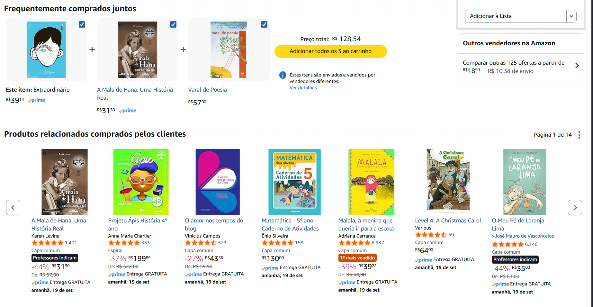

—

#### Detalhes técnicos do produto  
Seção com dados técnicos: ISBN-10 / ISBN-13, número de páginas, editora, dimensões, data de publicação.

O que observar / capturar: bloco “Detalhes do produto” com ISBNs e especificações.
Uso observado: importante para distinguir edições — crítico em livros acadêmicos.
UX notes: no marketplace universitário, mostrar edição/ISBN/ano deve ser prioridade (evita confusões entre edições).
  
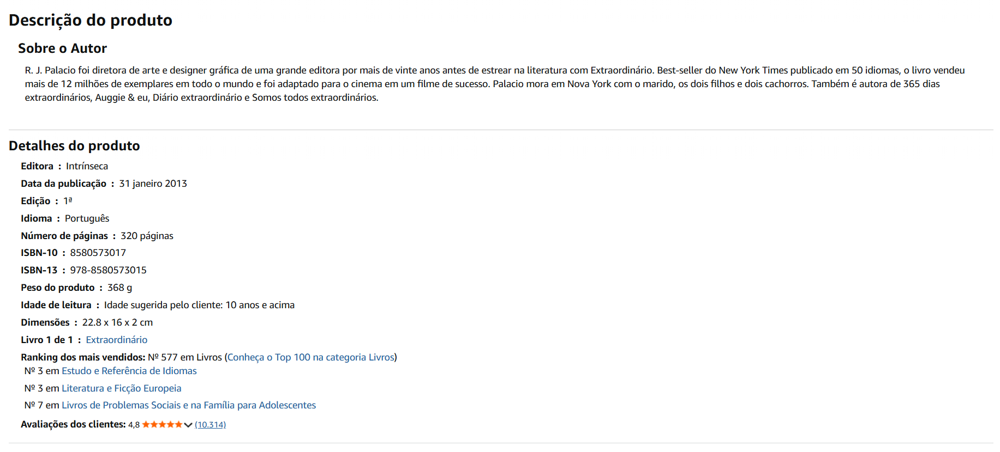

—

#### Avaliações do produto (estrelas, comentários e imagens)  
Sistema de classificação com barra de distribuição por estrelas, comentários textuais e imagens enviadas por compradores.

O que observar / capturar: gráfico de distribuição por estrelas, avaliações com imagens e comentários mais relevantes.
Uso observado: auxilia a confiança do comprador; imagens de usuários ajudam a avaliar a condição do item (no caso de usados).
UX notes: extremamente útil para reputação; para trocas entre alunos, incorporar avaliação do usuário e fotos da condição do livro é essencial.
  

—

#### Login / criação de conta  
Fluxo de login simples (e-mail/telefone) antes de prosseguir para ações críticas (contato, compra).

O que observar / capturar: tela de login/registro.
Uso observado: gating de funcionalidades (mensageria/checkout) através de conta.
UX notes: para a plataforma universitária, usar verificação institucional (email da universidade) melhora confiança/controle da comunidade.
  

---

### Pontos positivos e negativos  

#### Pontos Positivos:  
- Catálogo e PDP robustos: consolidação de edições/formatos e múltiplas ofertas — inspira como mostrar alternativas (novo/usado/permuta).
- Busca e auto-complete: acelera a descoberta; pré-visualização com capa ajuda muito.
- Filtros detalhados: possibilitam refinar por entrega/condição/preço — adaptar para filtros por curso/semestre/edição.
- Avaliações ricas: estrelas + comentários + fotos aumentam confiança — muito relevante para troca de livros usados.
- Recomendações: identificam livros complementares (úteis para sugerir livros de uma mesma disciplina).
- Mensageria e conta: controle de comunicação e histórico de transações.
 
#### Pontos Negativos:  
- Excesso de elementos na PDP pode confundir usuários que buscam trocar rapidamente.
- Complexidade de fluxo de venda (Seller Central, logística, taxas) é muito além do necessário para um sistema P2P universitário.
- Dependência de infraestrutura de pagamento e logística — para trocas presenciais entre alunos, simplificar (ou deixar opcional) evita atrito.
- Privacidade / segurança: Amazon é corporativa e possui políticas; replicar sem adaptação pode trazer burocracia desnecessária para um ambiente estudantil.

---

### Requisitos  

A partir das informações acima, temos alguns requisitos que podemos extrair da análise:  
- Criar fluxo de cadastro simples, mas com verificação institucional (e-mail da universidade).
- Implementar busca em tempo real com pré-visualização (capa + título + edição).
- Oferecer filtros avançados (curso/disciplinas, condição do livro, campus/localidade, preço, disponibilidade).
- Adotar PDP simplificada para trocas (foto, edição, estado, opção “troca por”).
- Implementar mensageria interna com templates e sistema de reputação leve (estrelas + comentário + foto).
- Opção de reserva/calendário para marcar retirada no campus.
- Painel simples para cadastrar/anunciar livro com fotos e campo “troca/venda/doação”.

-------------------------------------------------------------------------------------------------------------------------------

## Acervus UNICAMP (https://acervus.unicamp.br/)

O Acervus UNICAMP é o acervo digital de obras literárias da UNICAMP. Nele, é possível visualizar novas obras, acessar periódicos e reservar obras de interesse.

Nesse site, analisaremos as seguintes funcionalidades: **sistema de busca**, **histórico de empréstimos**, **acesso à produção científica**, **acessibilidade** e **Feedback de empréstimo**.

---

### Documentação de Features e Funcionalidades 

#### Sistema de busca

O acervus UNICAMP possui um robusto sistema de busca de obras, com vários campos a serem especificados, o que facilita encontrar uma obra específica. É possível especificar o título, autoria, edição, editora, entre outros.
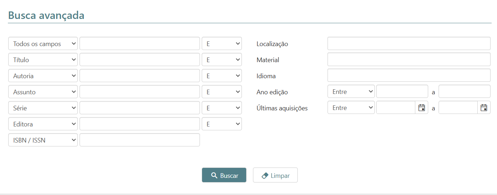
Além disso, é possível filtrar as obras por localização, ou seja, por biblioteca, o que possibilita o usuário escolher a biblioteca de preferência.
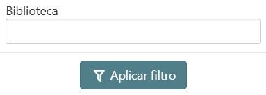

-

#### Histórico de Empréstimos

A plataforma conta com uma página, dentro do perfil, que mostra todo o histórico de empréstimo de livros, facilitando o controle de empréstimo pelo usuário e a renovação de empréstimos recorrentes.
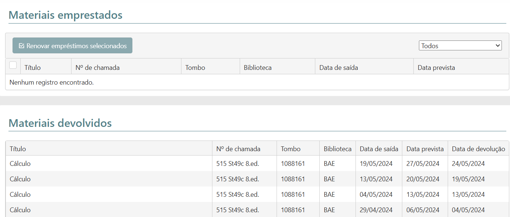

-

#### Acesso à produção científica

Além de livros acadêmicos e artísticos, também é possível acessar teses e papers a partir da plataforma. Isso permite o sistema abrangir uma maior diversidade de obras, e facilita o acesso de produções científicas aos usuários.
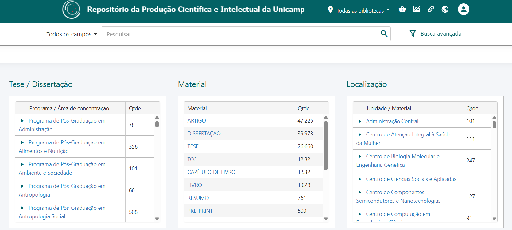

-

#### Acessibilidade

Um ponto importante sobre o sistema é que ele dispõe de várias opções de acessibilidade, incluindo um modo de alto contraste da página e um modo fácil de mudar o idioma da página.
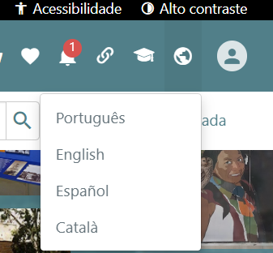

-

#### Feedback de empréstimo

Ao realizar um empréstimo, o usuário recebe feedback em seu e-mail, cadastrado na página de login. Os principais e-mails contém comprovante de reserva, no momento da reserva, recibo de empréstimo, recebido no momento em que a obra foi emprestada, e aviso de devolução, recebido nos dias próximos à data de devolução da obra emprestada. Esse sistema automático de feedback ajuda o usuário a acompanhar o processo de empréstimo e devolver a obra dentro do prazo.
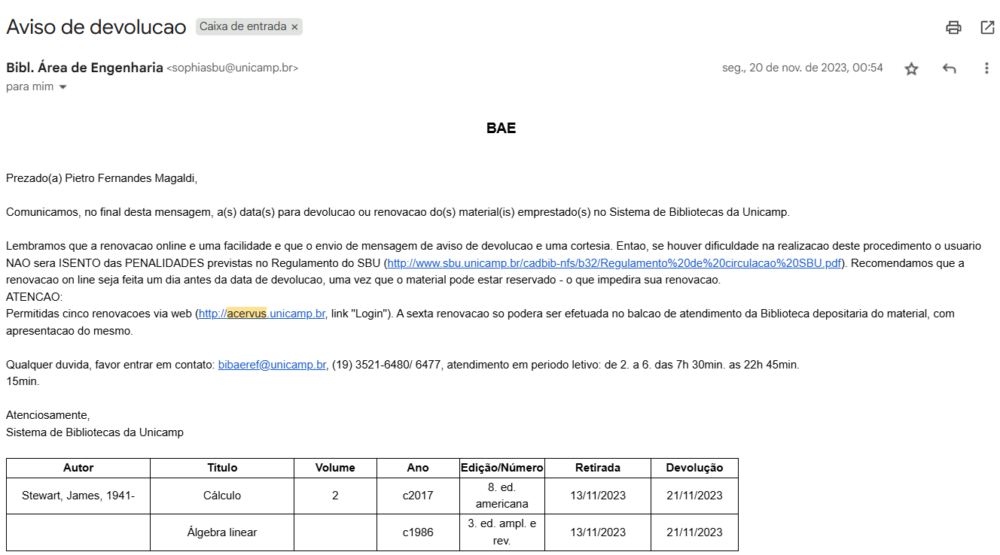

---

### Pontos positivos e negativos

#### Pontos positivos:
- Sistema de busca robusto, com possibilidade de alto detalhamento na busca
- Alta diversidade de obras
- Preocupação com acessibilidade
- Feedback sobre o processo de empréstimo

#### Pontos negativos:
- Exclusividade de login para discentes e doscentes da UNICAMP
- Baixa responsividade em aparelhos mobile
- Demora de atualização de obras disponíveis/reservadas

---

### Requisitos

Podemos extrair alguns requisitos a partir dos pontos levantados:
- Criar página de **histórico de empréstimos** que facilite visualização e renovação
- Adicionar opções de **acessibilidade** que facilitem o uso da plataforma, como idioma da página e modo de alto contraste
- Assegurar **responsividade** da plataforma a dispositivos mobile
- Implementar sistema automático de **feedback** sobre empréstimo, lembrando sobre prazo de devolução

